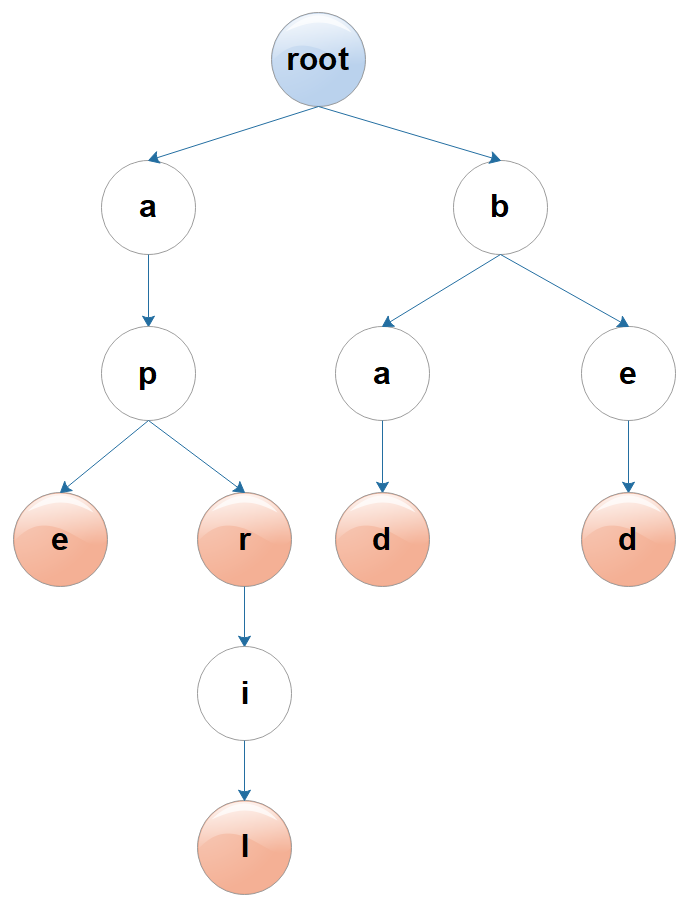
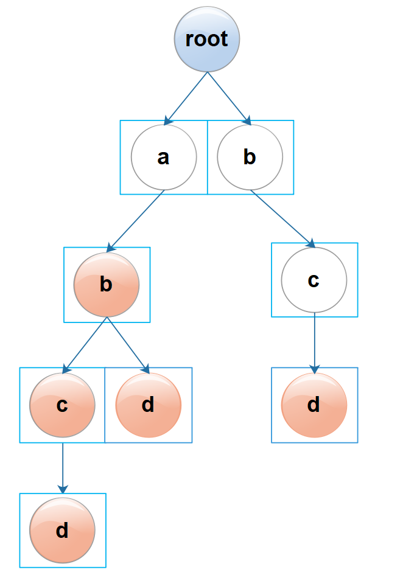

# xtool-1.0.5 参考文档

Author: [Patrick.Lau](mailto:patricklauxx@gmail.com)        Version: 1.0.5

[](https://www.apache.org/licenses/LICENSE-2.0.html)  [](https://github.com/patricklaux/xtool/releases)  [](https://search.maven.org/search?q=g:%22com.igeeksky.xtool%22%20AND%20a:%22xtool%22)  [](https://codecov.io/gh/patricklaux/xtool)  [](https://github.com/patricklaux/xtool/commits)  [](https://gitter.im/igeeksky/xtool?utm_source=badge&utm_medium=badge&utm_campaign=pr-badge&utm_content=badge)


------

## 1. 关于 xtool

### 1.1. 简介

xtool 是一个小小的 Java 工具集，遵循简单、可靠的原则，不求大而全，但求小而美。主要包含：

- 字符串、数值、容器、IO等工具类；
- 一些常用自定义注解；
- NLP 相关的数据结构。

### 1.2. 使用

#### 1.2.1.Maven

```xml

<dependency>
    <groupId>com.igeeksky.xtool</groupId>
    <artifactId>xtool</artifactId>
    <version>1.0.5</version>
</dependency>
```

#### 1.2.2.Gradle

```groovy
implementation 'com.igeeksky.xtool:xtool:1.0.5'
```

#### 1.2.3.编译安装

#### 项目地址：

- https://github.com/patricklaux/xtool/

- https://gitee.com/igeeksky/xtool

首先 git clone 项目，然后执行 maven 命令安装

```shell
# git clone项目到本地
git clone https://github.com/patricklaux/xtool.git

# 执行maven命令编译
mvn clean install
```

### 1.3. 参与

#### 1.3.1.分支介绍

| 分支     | 说明                         |
| -------- | ---------------------------- |
| **main** | 主分支，用于版本发布         |
| **dev**  | 开发分支，用于接受 PR 和修改 |

如您希望参与开发这个类库，请首先 fork 项目到您的仓库，修改 dev 分支并提交 pr，然后等待合并即可。

#### 1.3.2.开发约定

1. 无第三方依赖；
2. 缩进采用空格；
3. 添加完整注释；
4. 编写单元测试并运行通过。

#### 1.3.3.建议反馈

- [github](https://github.com/patricklaux/xtool/issues)
- [gitee](https://gitee.com/igeeksky/xtool/issues)

如您发现任何 bug，或希望添加某类工具，或有任何开发建议，欢迎提交issue。

**！！！总之，欢迎 pr，欢迎 issue！！！**


------

## 2. 自定义注解

### 2.1. @ParameterNames

**记录参数名称**

此注解可用于构造器和方法；运行期可读取。

JDK 1.8 之前不记录构造器和方法的参数名称；JDK 1.8 及之后的版本可以通过在编译时指定 -parameters来记录参数名称（默认不记录），但 Jar 包体积会增大。

如果我们需要反射生成的类是可以确定的，那么可以使用此注解来记录参数名，反射时再读取此注解来获取参数名。

```java
public class Pair<K, V> {

    @ParameterNames({"key", "value"})
    public Pair(K key, V value) {
        this.key = key;
        this.value = value;
    }

    // ......
}
```

### 2.2. @Perfect

**完美代码标识**

此注解可用于类、构造器、方法和字段；仅存在于源码。

对于确信已经完美而无需再行修改的代码，可使用此注解进行标识。

软件项目常常会有大量代码，因此需要标注已解决问题，从而让我们可以集中精力去解决未知问题，这个注解正是起到这样的作用。

```java

@Perfect
public class ConcurrentArrayTrie<V> implements Trie<V> {
    //......
}
```

------

## 3. 常用工具类

### 3.1. StringUtils

#### 3.1.1. hasText 与 hasLength

**判断字符串是否为空或空白**

[Apache Commons Lang](https://commons.apache.org/proper/commons-lang/) 的 StringUtils 提供了 *isBlank*、*isEmpty*
方法，我在使用时总要想一想仅有空白字符的情况应该用哪个方法。比较而言，*hasText* 和 *hasLength* 的命名会更加直观清晰，因此提供了这两个方法。

> **方法比较**
>
> 情形三：字符串只有空白字符
>
> - StringUtils.hasLength("   ") == true
> - StringUtils.hasText("   ") == false

```java
public class StringUtilsTest {
    @Test
    public void hasText() {
        // 情形一：字符串为空对象，hasText == false
        boolean hasText = StringUtils.hasText(null);
        Assert.assertFalse(hasText);

        // 情形二：字符串无字符，hasText == false
        hasText = StringUtils.hasText("");
        Assert.assertFalse(hasText);

        // 情形三：字符串只有空白字符，hasText == false
        hasText = StringUtils.hasText("   ");
        Assert.assertFalse(hasText);

        // 情形四：字符串有非空白字符，hasText == true
        hasText = StringUtils.hasText("a");
        Assert.assertTrue(hasText);

        // 情形五：字符串有非空白字符，hasText == true
        hasText = StringUtils.hasText(" a ");
        Assert.assertTrue(hasText);
    }

    @Test
    public void hasLength() {
        // 情形一：字符串为空对象，hasLength == false
        boolean hasLength = StringUtils.hasLength(null);
        Assert.assertFalse(hasLength);

        // 情形二：字符串无字符，hasText == false
        hasLength = StringUtils.hasLength("");
        Assert.assertFalse(hasLength);

        // 情形三：字符串只有空白字符，hasLength == true
        hasLength = StringUtils.hasLength("   ");
        Assert.assertTrue(hasLength);

        // 情形四：字符串有非空白字符，hasLength == true
        hasLength = StringUtils.hasLength("a");
        Assert.assertTrue(hasLength);

        // 情形五：字符串有非空白字符，hasLength == true
        hasLength = StringUtils.hasLength(" a ");
        Assert.assertTrue(hasLength);
    }
}
```

#### 3.1.2. trim 与 trimToNull

**去除空白字符**

> **方法比较**
>
> 情形二：字符串无字符
>
> - StringUtils.trim("") == ""
> - StringUtils.trimToNull("") == null
>
> 情形三：字符串只有空白字符
>
> - StringUtils.trim("    ") == ""
> - StringUtils.trimToNull("    ") == null

```java
public class StringUtilsTest {
    @Test
    public void trim() {
        // 情形一：字符串为空对象，trim == null
        String trim = StringUtils.trim(null);
        Assert.assertNull(trim);

        // 情形二：字符串无字符，trim == ""
        trim = StringUtils.trim("");
        Assert.assertEquals("", trim);

        // 情形三：字符串只有空白字符，trim == ""
        trim = StringUtils.trim("   ");
        Assert.assertEquals("", trim);

        // 情形四：字符串有非空白字符，trim == "a"
        trim = StringUtils.trim("a");
        Assert.assertEquals("a", trim);

        // 情形五：字符串有非空白字符，trim == "a"
        trim = StringUtils.trim(" a ");
        Assert.assertEquals("a", trim);
    }

    @Test
    public void trimToNull() {
        // 情形一：字符串为空对象，trimToNull == null
        String trimToNull = StringUtils.trimToNull(null);
        Assert.assertNull(trimToNull);

        // 情形二：字符串无字符，trimToNull == null
        trimToNull = StringUtils.trimToNull("");
        Assert.assertNull(trimToNull);

        // 情形三：字符串只有空白字符，trimToNull == null
        trimToNull = StringUtils.trimToNull("   ");
        Assert.assertNull(trimToNull);

        // 情形四：字符串有非空白字符，trimToNull == "a"
        trimToNull = StringUtils.trimToNull("a");
        Assert.assertEquals("a", trimToNull);

        // 情形五：字符串有非空白字符，trimToNull == "a"
        trimToNull = StringUtils.trimToNull(" a ");
        Assert.assertEquals("a", trimToNull);
    }
}
```

#### 3.1.3. toUpperCase 与 toLowerCase

**字符串大小写转换**

> **提示**：转大写或转小写之前会先调用 StringUtils.trimToNull() 方法，因此如果字符串没有非空白字符，返回结果为 null

```java
public class StringUtilsTest {
    @Test
    public void toUpperCase() {
        // 情形一：字符串为空对象，upperCase == null
        String upperCase = StringUtils.toUpperCase(null);
        Assert.assertNull(upperCase);

        // 情形二：字符串无字符，upperCase == null
        upperCase = StringUtils.toUpperCase("");
        Assert.assertNull(upperCase);

        // 情形三：字符串只有空白字符，upperCase == null
        upperCase = StringUtils.toUpperCase("   ");
        Assert.assertNull(upperCase);

        // 情形四：字符串有非空白字符，upperCase == "AAA"
        upperCase = StringUtils.toUpperCase("aaa");
        Assert.assertEquals("AAA", upperCase);

        // 情形五：字符串有非空白字符，upperCase == "AAA"
        upperCase = StringUtils.toUpperCase(" aaa ");
        Assert.assertEquals("AAA", upperCase);
    }

    @Test
    public void toLowerCase() {
        // 与toUpperCase 方法类似，只不过是转为小写，略
    }
}
```

#### 3.1.4. capitalize 与 unCapitalize

**字符串的首字符大小写转换**

```java
public class StringUtilsTest {
    @Test
    public void capitalize() {
        // 情形一：字符串为空对象，capitalize == null
        String original = null;
        String capitalize = StringUtils.capitalize(original);
        Assert.assertNull(capitalize);

        // 情形二：字符串无字符，capitalize == ""
        capitalize = StringUtils.capitalize("");
        Assert.assertEquals("", capitalize);

        // 情形三：字符串只有空白字符，capitalize == "   "
        capitalize = StringUtils.capitalize("   ");
        Assert.assertEquals("   ", capitalize);

        // 情形四：字符串有非空白字符，首字符为字母且为小写，capitalize == "Aaa"
        capitalize = StringUtils.capitalize("aaa");
        Assert.assertEquals("Aaa", capitalize);

        // 情形五：字符串有非空白字符，首字符为字母且为大写，capitalize == "Aaa"
        capitalize = StringUtils.capitalize("Aaa");
        Assert.assertEquals("Aaa", capitalize);

        // 情形六：字符串有非空白字符，首字符为非字母，capitalize == " aaa "
        capitalize = StringUtils.capitalize(" aaa ");
        Assert.assertEquals(" aaa ", capitalize);
    }

    @Test
    public void unCapitalize() {
        // 与 capitalize 方法类似，只不过是首字符转小写，略
    }
}
```

### 3.2. NumberUtils

#### 3.2.1. toXXX 转换为数值

- toLong(Object original) ：无默认值，返回值为包装类型（转换异常时抛出异常）；

- toLong(Object original, long defaultValue) ：有默认值，返回值为原始数据类型(捕捉转换异常，异常时返回默认值)。

```java
public class NumberUtilsTest {
    @Test
    public void toLong() {
        Long expected = 123456L;

        // 情形一：数值字符串转Long，toLong == 123456L
        Long toLong = NumberUtils.toLong("123456");
        Assert.assertEquals(expected, toLong);

        // 情形二：空字符串转Long，toLong == null
        toLong = NumberUtils.toLong("");
        Assert.assertNull(toLong);

        // 情形三：空白字符串转Long，toLong == null
        toLong = NumberUtils.toLong("   ");
        Assert.assertNull(toLong);

        // 情形四：含空白的数值字符串转Long，toLong == 123456L
        toLong = NumberUtils.toLong("  123456  ");
        Assert.assertEquals(expected, toLong);

        // 情形五：空对象转Long，toLong == null
        toLong = NumberUtils.toLong(null);
        Assert.assertNull(toLong);

        // 情形六：非数值字符串转Long，异常
        String message = null;
        try {
            toLong = NumberUtils.toLong("error");
            Assert.assertNull(toLong);
        } catch (NumberFormatException e) {
            message = e.getMessage();
        }
        Assert.assertEquals("For input string: \"error\"", message);

        // 情形七：Long转Long，toLong == 123456L
        toLong = NumberUtils.toLong(123456L);
        Assert.assertEquals(expected, toLong);

        // 情形八：Integer转Long，toLong == 123456L
        toLong = NumberUtils.toLong(123456);
        Assert.assertEquals(expected, toLong);

        // 情形九：Double转Long，toLong == 123456L
        toLong = NumberUtils.toLong(123456.1D);
        Assert.assertEquals(expected, toLong);
    }

    @Test
    public void testToLong() {
        long defaultValue = 100000L;

        // 情形一：数值字符串转Long，toLong == 123456L
        long toLong = NumberUtils.toLong("123456", defaultValue);
        Assert.assertEquals(123456L, toLong);

        // 情形二：空字符串转Long，toLong == defaultValue
        toLong = NumberUtils.toLong("", defaultValue);
        Assert.assertEquals(defaultValue, toLong);

        // 情形三：空白字符串转Long，toLong == defaultValue
        toLong = NumberUtils.toLong("   ", defaultValue);
        Assert.assertEquals(defaultValue, toLong);

        // 情形四：含空白的数值字符串转Long，toLong == 123456L
        toLong = NumberUtils.toLong("  123456  ", defaultValue);
        Assert.assertEquals(123456L, toLong);

        // 情形五：空对象转Long，toLong == defaultValue
        toLong = NumberUtils.toLong(null, defaultValue);
        Assert.assertEquals(defaultValue, toLong);

        // 情形六：非数值字符串转Long，toLong == defaultValue
        toLong = NumberUtils.toLong("error", defaultValue);
        Assert.assertEquals(defaultValue, toLong);

        // 情形七：Long转Long，toLong == 123456L
        toLong = NumberUtils.toLong(123456L, defaultValue);
        Assert.assertEquals(123456L, toLong);

        // 情形八：Integer转Long，toLong == 123456L
        toLong = NumberUtils.toLong(123456, defaultValue);
        Assert.assertEquals(123456L, toLong);

        // 情形九：Double转Long，toLong == 123456L
        toLong = NumberUtils.toLong(123456.1D, defaultValue);
        Assert.assertEquals(123456L, toLong);
    }
}
```

> **提示**：另外，还有 *toInteger*、*toShort*、 *toByte*、 *toDouble*、 *toFloat* 方法，与 *toLong* 类似，略。

### 3.3. BooleanUtils

#### 3.3.1. toBoolean 转换为布尔值

此方法与 NumberUtils.toXXX() 类似。

```java
/*
 * toBoolean(Object original) 无默认值，返回值为包装类型；
 * toBoolean(Object original, boolean defaultValue) 有默认值，返回值为原始数据类型(捕捉转换异常，异常时返回默认值)
 */
public class BooleanUtilsTest {

    @Test
    public void toBoolean() {
        // 情形一：布尔字符串转Boolean，toBoolean == false
        Boolean toBoolean = BooleanUtils.toBoolean("false");
        Assert.assertFalse(toBoolean);

        // 情形二：空字符串转Boolean，toBoolean == null
        toBoolean = BooleanUtils.toBoolean("");
        Assert.assertNull(toBoolean);

        // 情形三：空白字符串转Boolean，toBoolean == null
        toBoolean = BooleanUtils.toBoolean("   ");
        Assert.assertNull(toBoolean);

        // 情形四：含空白的布尔字符串转Boolean，toBoolean == false
        toBoolean = BooleanUtils.toBoolean("  false  ");
        Assert.assertFalse(toBoolean);

        // 情形五：空对象转Boolean，toBoolean == null
        toBoolean = BooleanUtils.toBoolean(null);
        Assert.assertNull(toBoolean);

        // 情形六：Boolean转Boolean，toBoolean == false
        toBoolean = BooleanUtils.toBoolean(false);
        Assert.assertFalse(toBoolean);

        // 情形七：非布尔字符串转Boolean，异常
        String message = null;
        try {
            BooleanUtils.toBoolean("error");
        } catch (IllegalArgumentException e) {
            message = e.getMessage();
        }
        Assert.assertEquals("For input string: \"error\"", message);
    }

    @Test
    public void testToBoolean() {
        // 情形一：布尔字符串转Boolean，toBoolean == false
        boolean toBoolean = BooleanUtils.toBoolean("false", true);
        Assert.assertFalse(toBoolean);

        // 情形二：空字符串转Boolean，toBoolean == defaultValue == true
        toBoolean = BooleanUtils.toBoolean("", true);
        Assert.assertTrue(toBoolean);

        // 情形三：空白字符串转Boolean，toBoolean == defaultValue == true
        toBoolean = BooleanUtils.toBoolean("   ", true);
        Assert.assertTrue(toBoolean);

        // 情形四：含空白的布尔字符串转Boolean，toBoolean == false
        toBoolean = BooleanUtils.toBoolean("  false  ", true);
        Assert.assertFalse(toBoolean);

        // 情形五：空对象转Boolean，toBoolean == defaultValue == true
        toBoolean = BooleanUtils.toBoolean(null, true);
        Assert.assertTrue(toBoolean);

        // 情形六：Boolean转Boolean，toBoolean == false
        toBoolean = BooleanUtils.toBoolean(false, true);
        Assert.assertFalse(toBoolean);

        // 情形七：非布尔字符串转Boolean，toBoolean == defaultValue == true
        toBoolean = BooleanUtils.toBoolean("error", true);
        Assert.assertTrue(toBoolean);
    }
}
```

### 3.4. IOUtils

IOUtils 提供了关闭流 和 复制流的静态方法，比较简单，略。

#### 3.4.1. close 关闭流

详见接口文档，略。

#### 3.4.2. copy 复制流

详见接口文档，略。

### 3.5. IOException

关闭流或复制流时如果发生了异常，通常我们什么都不能做，因此用这个类将 java.io.IOException 转换为 RuntimeException。

```java
package com.igeeksky.xtool.core.io;

public class IOException extends RuntimeException {
    // 略
}
```

### 3.6. Assert 断言

#### 3.6.1. 主要方法

- isTrue 判断表达式是否为真
- isFalse 判断表达式是否为假
- notEmpty 判断集合是否为空对象或无元素
- hasText 判断字符串是否不为空且含有非空白字符
- hasLength 判断字符串是否不为空且至少有一个字符（可以为空白字符）
- notNull 判断对象是否不为空

#### 3.6.2. 参数说明

每个方法都支持三种不同的入参，调用者可以自行选择：

- String message 异常提示信息
- Supplier<String> supplier 异常信息提供者（只有在真的发生异常时才调用supplier.get()方法获取异常提示信息，避免产生字符串对象）
- RuntimeException e 自定义的异常

#### 3.6.3. 默认异常类型：

java.lang.IllegalArgumentException

#### 3.6.4. 代码示例

```java
public class AssertTest {
    @Test
    public void isTrue() {

        // 异常时使用默认的提示信息
        Assert.isTrue(true);

        // 异常时使用传入的提示信息
        Assert.isTrue(true, "error");

        // 异常时使用 supplier.get() 获取提示信息
        Assert.isTrue(true, () -> "error");

        // 异常时抛出用户传入的异常
        Assert.isTrue(true, new RuntimeException("error"));
    }

    @Test
    public void isFalse() {
        // 略
    }
}
```

其它更多信息请参考接口文档，略。


------

## 4. 集合与数组

### 4.1. CollectionUtils

#### 4.1.1. isEmpty 与 isNotEmpty

```java
public class CollectionUtilsTest {
    @Test
    public void testIsEmpty() {

        // 情形一：集合不含元素，isEmpty == true
        boolean isEmpty = CollectionUtils.isEmpty(Collections.emptyList());
        Assert.assertTrue(isEmpty);


        // 情形二：集合为空对象，isEmpty == true
        isEmpty = CollectionUtils.isEmpty(null);
        Assert.assertTrue(isEmpty);


        // 情形三：集合含有至少一个元素，isEmpty == false
        isEmpty = CollectionUtils.isEmpty(Collections.singletonList("a"));
        Assert.assertFalse(isEmpty);
    }

    @Test
    public void testIsNotEmpty() {

        // 情形一：集合不含元素，isNotEmpty == false
        boolean isNotEmpty = CollectionUtils.isNotEmpty(Collections.emptyList());
        Assert.assertFalse(isNotEmpty);


        // 情形二：集合为空对象，isNotEmpty == false
        isNotEmpty = CollectionUtils.isNotEmpty(null);
        Assert.assertFalse(isNotEmpty);


        // 情形三：集合含有至少一个元素，isNotEmpty == true
        isNotEmpty = CollectionUtils.isNotEmpty(Collections.singletonList("a"));
        Assert.assertTrue(isNotEmpty);
    }

}
```

#### 4.1.2. concat 多个集合拼接

*concat*(Collection<E>... collections) 方法是可变参数，支持多个集合的拼接。

考虑到大多数情况下，我们需要的都是特定类型的集合，而不是固定的 *LinkedList* 或 *ArrayList*，因此使用用户传入的第一个集合来拼接其它集合。

```java
public class MapsTest {
    @Test
    public void testConcat() {
        List<String> first = new ArrayList<>(2);
        Collection<String> concat = CollectionUtils.concat(first, Collections.singletonList("a"), Collections.singletonList("b"));
        Assert.assertEquals("[a, b]", concat.toString());
    }
}
```

> **注意**：
>
> - 第一个集合如果是 *ArrayList*，请预先计算并指定容量，避免在拼接过程中扩容。
> - 第一个集合不能是 *Collections.singletonList()* 或 *Collections.emptyList()*  之类无法添加元素的集合。


**CollectionUtils** 只有这三个最常用的方法，没有更多了😀！

如果您有某个方法经常要用而又不想写重复代码，欢迎提交 pr 或 issue！

### 4.2. Maps

#### 4.2.1. isEmpty 与 isNotEmpty

其处理逻辑与 **CollectionUtils.isEmpty** 相似，略。

#### 4.2.2. 合并两个 map

sourceMap 的 *key-value* 合并到 targetMap

```java
// 代码示例
public class MapsTest {
    @Test
    public void testMerge() {
        HashMap<String, String> targetMap = new HashMap<>();
        targetMap.put("a", "a");
        targetMap.put("b", null);

        HashMap<String, String> sourceMap = new HashMap<>();
        sourceMap.put("a", "x");
        sourceMap.put("b", "y");
        sourceMap.put("c", "c");
        sourceMap.put("d", null);

        Map<String, String> merge = Maps.merge(targetMap, sourceMap);

        // 情形一：targetMap 含有键 "a"，保留 targetMap 的原值，不覆盖；
        // 情形二：targetMap 含有键 "b"，保留 targetMap 的空值，不覆盖（即使 "b"对应的value为空）；
        // 情形三：targetMap 不含键 "c"，将 sourceMap 的 c=c 复制到 targetMap
        // 情形四：targetMap 不含键 "d"，将 sourceMap 的 d=null 复制到 targetMap（即使 "d"对应的value为空）
        Assert.assertEquals("{a=a, b=null, c=c, d=null}", merge.toString());
    }
}
```

> **注意**：
>
> - 只有 targetMap 没有的key ，才从 sourceMap 中复制到 targetMap ；targetMap 已有的 key，一律保留原值（即使值为空）。
> - targetMap 不能为 *Collections.emptyMap()*、*Collections.singletonMap()* …… 等无法添加元素的 map

#### 4.2.3. 获取Map中的值并转换成目标类型

- **getLong(Map<K,V> map, K key)  无默认值**

从 map 中查找 key 对应的 value，如果 value 不为空，则将该 value 转换为Long并返回；否则，返回 null。

```java
public class MapsTest {
    @Test
    public void testGetLong() {
        HashMap<String, String> map = new HashMap<>();
        map.put("a", "1000");
        map.put("b", null);
        map.put("notNumber", "notNumber");

        // 情形一：map中包含键"a"，值不为空，转换正常，值转换为 Long 并返回
        Long value = Maps.getLong(map, "a");
        Long expected = 1000L;
        Assert.assertEquals(expected, value);

        // 情形二：map中包含键"b"，但值为空，返回 null
        value = Maps.getLong(map, "b");
        Assert.assertNull(value);

        // 情形三：map中不含键"c"，返回 null
        value = Maps.getLong(map, "c");
        Assert.assertNull(value);

        // 情形四：map中包含含键 "error"，值不为空，但转换异常，抛出异常
        String message = null;
        try {
            Maps.getLong(map, "notNumber");
        } catch (NumberFormatException e) {
            message = e.getMessage();
        }
        Assert.assertEquals("For input string: \"notNumber\"", message);
    }
}
```

- **getLong(Map<K,V> map, K key, Long defaultValue) 有默认值**

从 map 中查找 key 对应的 value，如果 value 不为空，则将该 value 转换为Long并返回；否则，返回默认值。

```java
public class MapsTest {
    @Test
    public void testGetLong2() {
        HashMap<String, String> map = new HashMap<>();
        map.put("a", "1000");
        map.put("b", null);
        map.put("notNumber", "notNumber");

        long defaultValue = 99999L;

        // 情形一：map中包含键"a"，值不为空，转换正常，值转换为 Long 并返回
        long value = Maps.getLong(map, "a", defaultValue);
        Assert.assertEquals(1000L, value);

        // 情形二：map中包含键"b"，但值为空，返回 defaultValue
        value = Maps.getLong(map, "b", defaultValue);
        Assert.assertEquals(defaultValue, value);

        // 情形三：map中不含键"c"，返回 defaultValue
        value = Maps.getLong(map, "c", defaultValue);
        Assert.assertEquals(defaultValue, value);

        // 情形四：map中包含键 "notNumber"，值不为空，但转换异常，返回 defaultValue
        value = Maps.getLong(map, "notNumber", defaultValue);
        Assert.assertEquals(defaultValue, value);
    }
}
```

> **提示**：
>
> - 另外还有 *getInteger*，*getShort* …… *getString* 等方法，使用方式与 *getLong* 大同小异，略。
>
> - *Maps.getLong* 、*Maps.getInteger* …… 等方法其实是调用了 NumberUtils.toXXX 和 BooleanUtils.toBoolean，因此响应逻辑是一致的。

### 4.3. ArrayUtils

#### 4.3.1. isEmpty 与 isNotEmpty

支持泛型数组和 byte数组，其处理逻辑与 **CollectionUtils.isEmpty** 相似，略。

#### 4.3.2. getFirst与getLast

- **getFirst**：获取数组的第一个元素；
- **getLast**：获取数组的最后一个元素。

```java
public class ArrayUtilsTest {
    // 支持泛型数组和 byte数组
    @Test
    public void getFirst() {
        String[] array = new String[]{"a", "b", "c", "d"};
        Assert.assertEquals("a", ArrayUtils.getFirst(array));

        Byte expected = 1;
        byte[] bytes = new byte[]{1, 2, 3, 4};
        Assert.assertEquals(expected, ArrayUtils.getFirst(bytes));
    }

    @Test
    public void getLast() {
        String[] array = new String[]{"a", "b", "c", "d"};
        Assert.assertEquals("d", ArrayUtils.getLast(array));

        Byte expected = 4;
        byte[] bytes = new byte[]{1, 2, 3, 4};
        Assert.assertEquals(expected, ArrayUtils.getLast(bytes));
    }
}
```

#### 4.3.3. concat 多个数组拼接

其处理逻辑与 **CollectionUtils.concat ** 相似，不同点：

- ArrayUtils.concat 返回的是新数组；
- CollectionUtils.concat 返回的是原集合（入参的第一个集合）。

```java
public class ArrayUtilsTest {
    // 支持泛型数组和 byte数组
    @Test
    public void concat() {
        String[] array1 = new String[]{"a", "b", "c", "d"};
        String[] array2 = new String[]{"e", "f", "g", "h"};
        Assert.assertEquals("[a, b, c, d, e, f, g, h]", Arrays.toString(ArrayUtils.concat(array1, array2)));
    }

    @Test
    public void testConcat() {
        byte[] array1 = new byte[]{1, 2, 3, 4};
        byte[] array2 = new byte[]{5, 6, 7, 8};
        Assert.assertEquals("[1, 2, 3, 4, 5, 6, 7, 8]", Arrays.toString(ArrayUtils.concat(array1, array2)));
    }
}
```

## 5. 安全工具类

### 5.1. DigestUtils

**摘要信息工具类**

#### 5.1.1. 支持算法

- MD5
- SHA-1
- SHA-224
- SHA-256
- SHA-384
- SHA-512

#### 5.1.2. 参数说明

- String text 字符串 （或 byte []）
- Charset charset 字符编码（可省略，默认为 StandardCharsets.UTF_8 ）
- boolean lowerCase 是否使用小写字符（可省略，默认为 true ，）

#### 5.1.3. 代码示例

```java
public class DigestUtilsTest {
    // 测试 String text
    @Test
    public void md5() {
        String text = "Less is more";

        // 默认字符编码为 StandardCharsets.UTF_8；默认使用小写字符
        String hex = DigestUtils.md5(text);
        Assert.assertEquals("df6ae335a4f5cf721002eaa9299f4a9d", hex);

        // 默认使用小写字符
        hex = DigestUtils.md5(text, StandardCharsets.UTF_8);
        Assert.assertEquals("df6ae335a4f5cf721002eaa9299f4a9d", hex);

        // 默认字符编码为 StandardCharsets.UTF_8
        hex = DigestUtils.md5(text, true);
        Assert.assertEquals("df6ae335a4f5cf721002eaa9299f4a9d", hex);

        // 指定字符编码为 StandardCharsets.UTF_8；指定使用小写字符
        hex = DigestUtils.md5(text, StandardCharsets.UTF_8, true);
        Assert.assertEquals("df6ae335a4f5cf721002eaa9299f4a9d", hex);

        // 指定字符编码为 StandardCharsets.UTF_8；指定使用大写字符
        hex = DigestUtils.md5(text, StandardCharsets.UTF_8, false);
        Assert.assertEquals("DF6AE335A4F5CF721002EAA9299F4A9D", hex);
    }

    // 测试 byte[] bytes
    @Test
    public void testMd5() {
        byte[] bytes = "Less is more".getBytes(StandardCharsets.UTF_8);

        // 默认使用小写字符
        String hex = DigestUtils.md5(bytes);
        Assert.assertEquals("df6ae335a4f5cf721002eaa9299f4a9d", hex);

        // 指定使用小写字符
        hex = DigestUtils.md5(bytes, true);
        Assert.assertEquals("df6ae335a4f5cf721002eaa9299f4a9d", hex);

        // 指定使用大写字符
        hex = DigestUtils.md5(bytes, false);
        Assert.assertEquals("DF6AE335A4F5CF721002EAA9299F4A9D", hex);
    }
}
```

### 5.2. HexUtils

**16进制字符串工具类**

#### 5.2.1. encodeHex 与 encodeHexStr

- encodeHex 将字节数组转换成16进制的字符数组，返回 char[]
- encodeHexStr 将字节数组转换成16进制的字符串，返回 String

返回结果可参见上一小节的DigestUtilsTest，其它更多信息请参考接口文档，略。


------

## 6. 函数式编程

### 6.1. 元组

Haskell、Scala、Python 等函数式语言都有元组的概念，元组其实可看作是**容量不可变、元素不可变**的列表，但与列表不同的是**元组可以包含不同的元素类型**。

Java 编程当中，有很多时候需要用到一些不可变的定长列表，特别是 key-value，因此这里提供了两种元组。

- **Pair**：元素可以为空，构造方法为 Public（键值对）。
- **Tuple**：元素不能为空，构造方法为 Friendly，必须使用 Tuples 来创建（当前实现了 一元组 至 五元组）。

#### 6.1.1. Pair 与 Pairs

Pairs 是静态工厂类，用于创建 Pair。

##### 6.1.1.1 代码示例

```java
public class PairTest {

    // 获取 key
    @Test
    public void getKey() {
        Pair<String, String> pair = Pairs.of("key", "value");
        org.junit.Assert.assertEquals("key", pair.getKey());
    }

    // 获取 value
    @Test
    public void getValue() {
        Pair<String, String> pair = Pairs.of("key", "value");
        Assert.assertEquals("value", pair.getValue());
    }

    // 转换 key
    @Test
    public void mapKey() {
        Integer expected = 1;
        Pair<String, String> pair = Pairs.of("key", "value");
        Pair<Integer, String> newPair = pair.mapKey((k) -> 1);
        Assert.assertEquals(expected, newPair.getKey());
    }

    // 转换 value
    @Test
    public void mapValue() {
        Integer expected = 1;
        Pair<String, String> pair = Pairs.of("key", "value");
        Pair<String, Integer> newPair = pair.mapValue((k) -> 1);
        Assert.assertEquals(expected, newPair.getValue());
    }

    // key 是否为空
    @Test
    public void hasKey() {
        Pair<String, String> pair = Pairs.of("key", "value");
        Assert.assertTrue(pair.hasKey());
    }

    // value 是否为空
    @Test
    public void hasValue() {
        Pair<String, String> pair = Pairs.of("key", "value");
        Assert.assertTrue(pair.hasValue());
    }
}
```

#### 6.1.2. Tuple 与 Tuples

Tuples 是静态工厂类，用于创建 Tuple 。

##### 6.1.2.1 代码示例

```java
public class Tuple3Test {

    // 获取第1个元素
    @Test
    public void getT1() {
        Tuple3<String, String, String> tuple = Tuples.of("a", "b", "c");
        Assert.assertEquals("a", tuple.getT1());
    }

    // 获取第2个元素
    @Test
    public void getT2() {
        Tuple3<String, String, String> tuple = Tuples.of("a", "b", "c");
        Assert.assertEquals("b", tuple.getT2());
    }

    // 获取第3个元素
    @Test
    public void getT3() {
        Tuple3<String, String, String> tuple = Tuples.of("a", "b", "c");
        Assert.assertEquals("c", tuple.getT3());
    }

    // 转换第1个元素
    @Test
    public void mapT1() {
        Tuple3<String, String, String> tuple = Tuples.of("a", "b", "c");
        Assert.assertEquals("x", tuple.mapT1((t1) -> "x").getT1());
    }

    // 转换第2个元素
    @Test
    public void mapT2() {
        Tuple3<String, String, String> tuple = Tuples.of("a", "b", "c");
        Assert.assertEquals("x", tuple.mapT2((t2) -> "x").getT2());
    }

    // 转换第3个元素
    @Test
    public void mapT3() {
        Tuple3<String, String, String> tuple = Tuples.of("a", "b", "c");
        Assert.assertEquals("x", tuple.mapT3((t3) -> "x").getT3());
    }

    // 元组的元素数量
    @Test
    public void size() {
        Assert.assertEquals(3, Tuples.of("a", "b", "c").size());
    }

    // 转换成数组
    @Test
    public void toArray() {
        String[] expected = new String[]{"a", "b", "c"};
        Object[] actual = Tuples.of("a", "b", "c").toArray();
        int length = Math.max(expected.length, actual.length);
        for (int i = 0; i < length; i++) {
            Assert.assertEquals(expected[i], actual[i]);
        }
    }
}
```

------

## 7. 数值类

xtool 提供了两个数值类：

- IntegerValue（**！！非原子操作，非线程安全！！**）
- LongValue（**！！非原子操作，非线程安全！！**）

Java 已经有了 AtomicInteger ……等原子操作的数值类型，为什么还要再写这两个类呢？

因为很多时候我们并不需要原子操作，或者说我们可以通过锁来实现一组原子操作，因此并不需要使用 AtomicInteger。

但 Integer 和 Long 类型又没有递增、递减这些方法，因此写了这两个类。

### 7.1. IntegerValue 与 LongValue

#### 7.1.1. 主要方法

- get 获取值
- set 设置新值
- getAndSet 获取旧值，并设置新值
- increment 递增
- incrementAndGet 递增，并返回递增后的新值
- getAndIncrement 递增，并返回递增前的旧值
- decrement 递减
- decrementAndGet 递减，并返回递减后的新值
- getAndDecrement 递减，并返回递减前的旧值

#### 7.1.2. 代码示例

```java
public class IntegerValueTest {
    // 获取值
    @Test
    public void get() {
        IntegerValue integer = new IntegerValue();
        Assert.assertEquals(0, integer.get());
    }

    // 设置新值
    @Test
    public void set() {
        IntegerValue integer = new IntegerValue(100);
        integer.set(1);
        Assert.assertEquals(1, integer.get());
    }

    // 获取旧值，并设置新值
    @Test
    public void getAndSet() {
        IntegerValue integer = new IntegerValue(100);
        int oldVal = integer.getAndSet(1);
        Assert.assertEquals(100, oldVal);
        Assert.assertEquals(1, integer.get());
    }

    // 递增
    @Test
    public void increment() {
        IntegerValue integer = new IntegerValue(100);
        integer.increment();
        Assert.assertEquals(101, integer.get());
        integer.increment();
        Assert.assertEquals(102, integer.get());
        Assert.assertEquals(102, integer.get());
    }

    // 递增，并返回递增后的新值
    @Test
    public void incrementAndGet() {
        IntegerValue integer = new IntegerValue(100);
        int newVal = integer.incrementAndGet();
        Assert.assertEquals(101, newVal);
        Assert.assertEquals(101, integer.get());
    }

    // 递增，并返回递增前的旧值
    @Test
    public void getAndIncrement() {
        IntegerValue integer = new IntegerValue(100);
        int oldVal = integer.getAndIncrement();
        Assert.assertEquals(100, oldVal);
        Assert.assertEquals(101, integer.get());
        oldVal = integer.getAndIncrement();
        Assert.assertEquals(101, oldVal);
        Assert.assertEquals(102, integer.get());
    }

    // 递减
    @Test
    public void decrement() {
        IntegerValue integer = new IntegerValue(100);
        integer.decrement();
        Assert.assertEquals(99, integer.get());
        integer.decrement();
        Assert.assertEquals(98, integer.get());
        Assert.assertEquals(98, integer.get());
    }

    // 递减，并返回递减后的新值
    @Test
    public void decrementAndGet() {
        IntegerValue integer = new IntegerValue(100);
        int newVal = integer.decrementAndGet();
        Assert.assertEquals(99, newVal);
        Assert.assertEquals(99, integer.get());
    }

    // 递减，并返回递减前的旧值
    @Test
    public void getAndDecrement() {
        IntegerValue integer = new IntegerValue(100);
        int oldVal = integer.getAndDecrement();
        Assert.assertEquals(100, oldVal);
        Assert.assertEquals(99, integer.get());
        oldVal = integer.getAndDecrement();
        Assert.assertEquals(99, oldVal);
        Assert.assertEquals(98, integer.get());
    }
}
```

------

## 8. NLP 相关

### 8.1. 字典树 ConcurrentArrayTrie

2017年时曾利用一个周末的时间实现了基于 Hash + 单链表的字典树，现在回头来看：一是代码有些乱；二是方法比较少；三是不支持并发；四是单链表在 Hash 冲突严重的情况下会有性能问题。

因此这次开发 xtool 时就用 Hash + 单链表 + AVLTree 完全重写了一遍。那么，新版本的字典树做了哪些优化和支持哪些特性呢？

- 大容量：支持亿级以上的键值对。
- 泛型支持：键为字符串，值可以为其它数据类型；
- 时间复杂度：最好的情况为O(m)，最坏的情况为O(mlogn)，m 为字符串长度，n 为256。具体解释见 <a href="#time">为什么时间复杂度最坏的情况下为 O(mlogn)？</a>。
- 并发支持：使用分段的读写锁，最高支持 65536 个 key 同时写，高并发下无性能问题。
- 内存优化：使用自定义的单链表和 AVLTree，最大限度去除了可有可无的信息。
- 性能优化：使用新的遍历算法（非递归；无队列和栈），在大容量的情况下可以保持高效率遍历而无需担心内存溢出和栈溢出问题。

#### 8.1.1. 什么是字典树？

字典树 [Trie](https://en.wikipedia.org/wiki/Trie) 又称为前缀树，是一种搜索树。

假如有五个单词：ab, abc, abcd, abd, bcd

如果想判断某个单词是否存在，我们可以用 HashMap，时间复杂度为O(1)。但：

- 输入"ab"，输出前缀为 "ab" 的所有单词；

- 输入一段文本，输出文本中存在这五个单词的哪几个，以及单词出现的起止位置……

那么，HashMap 就有点难以处理了。这时，我们可以采用下图所示的树形结构。

<div align=center>
  
  <div align=center>图1</div>
</div>

每个单词看作是一个字符序列，每个字符是一个节点，节点之间用边相连。只要从根节点开始顺着序列路径查找，就能找到对应的单词。

- 蓝色节点 root 为起始节点，不保存字符和值；
- 白色节点和红色节点仅保存一个字符；
- 所有节点的子节点的字符不同。
- 白色节点为无值节点：表示从根节点到该白色节点的路径不构成一个完整的 Key。
- 红色节点为有值节点：表示从根节点到该红色节点的路径可构成一个完整的Key。

> **特别说明**：蓝色、白色和红色仅仅是为了便于理解作出的标识，字典树并没有这些颜色概念。

**Trie 与 HashMap 对比**

如果都使用字符串作为Key，Trie 可以替代 HashMap。那么，两者相比，分别适用哪些场景呢？我们从时间和空间两方面来分析。

- **空间性能**

  HashMap 的每一个 Key 都是完整字符串，而 Trie 充分利用了公共前缀，似乎字典树占用的内存空间会更少，但 Trie 每一个字符都需要一个节点，节点需要保存后缀节点指针、兄弟节点指针……等。

  因此，如果有大量的具有公共前缀的 key，Trie 的内存占用会更少；反之，Trie 的内存空间占用会更多。

- **时间性能**

  Trie 不需要计算哈希值，HashMap 需要计算哈希值。

  查找的时间复杂度：Trie 最好的情况下为O(m)，如果不考虑内存消耗，理论上最坏的情况也是O(m)，但真正实现通常都会考虑内存消耗，因此最坏的情况是O(mlog256)；HashMap 最好的情况下 为O(m)，最坏的情况是O(
  mlogk)。

  > 注1：m为字符串的长度，k 为 key 的数量；
  >
  > 注2：HashMap 会调用 Key 的 equals 方法，如果 Key 为 String，其 equals 方法是逐字符对比是否相同。因此，最好的情况下，HashMap 的查找时间复杂度需要 O(m)。我们常说 HashMap 的时间复杂度为O(1)，其实是将 Key 比较看作是常数时间。

  似乎，Trie 会更快。😀 但，String 的 字符数组在内存中分配的是连续空间，逐个比对的速度非常快；而 Trie 的每个字符的节点是非连续分配的，逐个比对的速度会比较慢。

  另，Trie 的某些节点可能在主存，某些节点在 cpu 缓存，比对过程可能需要多次访问主存；而 HashMap 可能仅需要访问一次主存。

  非严格测试：我随机生成 2500万个长度为5~8的字符串，HashMap的查找时间约为7秒，Trie 约为15秒，差距并不大。

字典树还有好多变种和进化，或优化空间性能，或优化时间性能，这里不深入讨论，如有兴趣可以阅读维基百科中关于[Trie](https://en.wikipedia.org/wiki/Trie) 的介绍。

现在，我们先来考虑选择什么方式去构造这样的一棵字典树。

#### 8.1.2. 字典树的实现

##### 8.1.2.1. 树的节点

**HashMap？**

如果节点用 HashMap来实现，查找单个字符后缀的时间复杂度为O(1)，时间性能很好，但空间利用率不高。

- HashMap 的扩容因子是 0.75，每次扩容是原容量的 2 倍，且不支持缩容，这意味着会有大量的空间浪费；
- HashMap 还保存了一些附加信息，如 size，modCount……等，相当于每存一个字符，就要存储N倍信息。

**二叉树？**

如果节点用二叉树来实现，查找单个字符后缀的时间复杂度为O(logn)，时间性能一般，空间性能一般。

- 需要保存左右孩子指针和后缀节点指针；
- 可能还需要保存父节点指针和高度信息。

**自定义节点**

为了能达到 HashMap 的时间性能，又能减少空间消耗，这里定义了两种数据结构：单链表节点和 AVL 节点。

- **单链表节点**

```java
public class LinkedNode<V> {
    // 字符
    final char c;

    // 值（可能为空，如果值不为空，则表示从根节点到该节点的路径构成一个完整的单词；值可以是字符串，也可以是其它数据类型）
    V value;

    // 当前的子节点数量
    int size;

    // 子节点
    Node<V>[] table;


    // Hash冲突时保存兄弟节点
    LinkedNode<V> next;
}
```

- **AVL节点**

```java
public class AvlNode<V> {
    // 字符
    final char c;

    // 值（可能为空，如果值不为空，则表示从根节点到该节点的路径构成一个完整的单词；值可以是字符串，也可以是其它数据类型）
    V value;

    // 当前的子节点数量
    int size;

    // 子节点（保存直接后缀节点）
    Node<V>[] table;


    // Avl树的高度
    byte height;

    // 左孩子：Hash冲突时保存兄弟节点
    AvlNode<V> left;

    // 右孩子：Hash冲突时保存兄弟节点
    AvlNode<V> right;
}
```

**AvlTree or RedBlackTree？**

LinkedNode 在 Hash 冲突严重时会有性能问题，因此需要树形结构来作为补充，当 Hash 冲突超过阈值则将链表转换为树，Java 的HashMap 使用的是 RedBlackTree。

一般来说，RedBlackTree 的增删性能比 AvlTree 要好（实际上大多数场景两者差别细微），AVLTree 的查找性能比 RedBlackTree
要好。考虑到字典树通常不会有频繁的增删操作，因此选择AVLTree。另外，AvlTree 比 RedBlackTree 需要的信息更少（至少可以省去颜色标识），出于节省空间考虑，同样是选择 AVLTree。

这里定义的 AvlNode 相比 HashMap 中定义的 TreeNode（RedBlackTree），删减了父节点指针、前驱指针、后继指针和颜色标识，会更节省空间，但删减信息带来的副作用就是增加了程序复杂度。

如果是一棵庞大的字典树，节点数过亿，或达到十亿级，每节省一个信息都会减少大量的内存。出于这样的考虑，所以，程序复杂一些也是值得的。

**AvlNode 与 LinkedNode**

AvlNode 相比 LinkedNode 多了两个信息，会多消耗一些空间。

AvlNode 的增删查操作也比 LinkedNode 要复杂得多，而且多了一种数据结构，就需要增加节点转换操作，还要考虑对象的继承和封装，因此程序整体的复杂度也会增加不少。

如果不考虑极端情况，仅仅使用单链表是可行的，在正常情况下，仅使用 LinkedNode 性能反而会更好。但在 Hash 冲突严重的场景下（譬如 Hash 攻击），性能则会大幅降低。

**总结**

- 如果仅使用LinkedNode，降低了程序的复杂度，减少了空间消耗，但查找的时间复杂度的上限变成了O(n)；
- 增加了 AvlNode，增加了程序的复杂度，增加了空间消耗，但可以保证查找的时间复杂度的上限是O(logn)。

总而言之，开源类库面对的是通用场景，而不是某个特定场景，因此需要考虑更多情况，以达到某种意义上的平衡。

##### 8.1.2.2. 树的创建

<div align=center>
  
  <div align=center>图2</div>
</div>

> 注：蓝色方框为数组，也就是节点定义里的 table，用于保存直接后缀节点。

1. 创建root节点；

2. 添加单词 abc：

   2.1. root 节点创建 table，初始容量为1，table中添加 a 节点，++root.size。

   2.2. a 节点创建 table，初始容量为1，table 中添加 b 节点，++a.size。

   2.3. b 节点创建 table，初始容量为1，table 中添加 c 节点，++b.size；c 为单词结尾，c 节点的 value 设置为 “abc”。

3. 添加单词 abd：

   3.1. 判断 root 节点 有无 a 节点： a & (table.length-1) 计算下标，发现 table[0] 已有 a 节点，无需创建 a 节点。

   3.2. 判断 a 节点的 table 有无 b 节点，已有 b 节点，无需创建 b 节点。

   3.3. 判断 b 节点的 table 有无 d 节点，没有 d 节点，但 b 节点的 table 容量只有1，出现Hash冲突。选择一：扩容 table；选择二：c 节点的 next 指针指向 d 节点。选择扩容，table
   扩容为2，table[1] = d 节点，++b.size；d 为单词结尾，d 节点的 value 设置为 “abd”。

4. 重复过程3，添加 ab, abcd, bcd，最终得到的树结构如 **图2** 所示。

**代码实现：**

```java
public abstract class Node<V> {
    @Override
    public Node<V> addChild(char c, NodeCreator<V> creator, NodeConvertor<? extends Node<V>, ? extends TreeNode<V>> convertor) {
        // 创建 table
        if (this.table == null) {
            table = new Node[TrieConstants.TABLE_INITIAL_CAPACITY];
        }

        // 扩容
        expand(convertor);

        int index = c & (table.length - 1);
        Node<V> head = table[index];
        // 如果当前数组中对应位置头节点为空
        if (head == null) {
            head = creator.apply(c);
            table[index] = head;
            this.increment();
            return head;
        }

        return head.insert(this, index, c, convertor);
    }
}
```

循环调用 addChild 方法，依次插入字符串的每一个字符，最后一个字符的节点设置 value。

##### 8.1.2.3. 单词查找

**代码实现：**

```java
public abstract class Node<V> {

    @Override
    public Node<V> findChild(char c) {
        if (null == table) {
            return null;
        }
        Node<V> head = table[c & (table.length - 1)];
        if (head != null) {
            if (head.c == c) {
                return head;
            }
            return head.find(c);
        }
        return null;
    }
}
```

循环调用 findChild 方法，依次查找字符串的每一个字符，并判断节点是否存在。如果到达单词结尾，且节点的 value 不为空，则说明单词匹配成功。

##### 8.1.2.4. 扩容缩容

- **扩容**

  table 的初始容量为1，每次扩容为原容量的2倍，扩容因子为2（节省内存）。

  当容量为 1，size >= 2，扩容为2；

  当容量为2，size >= 4，扩容为4

  ……

  当容量为128，size >= 256，扩容为256；

  当容量为256，size >= 512，扩容为512

  ……

  当容量为16384，size >= 32768，扩容为32768；

  当容量为32768，size  > 63488，扩容为65536。

- **缩容**

  如果 size > 63458，容量保持65536；

  如果 size > 32768，且 size < (当前容量 - 28)，缩容为32768；

  如果 size > 16384，且 size < (当前容量 - 26)，缩容为16384

  ……

  如果 size > 8，且 size < (当前容量 - 4 )，缩容为4；

  如果 size > 4，且 size < (当前容量 - 2 )，缩容为4；

  如果 size < 4，缩容为2；

  如果 size < 2，缩容为1；

  如果 size < 1，缩容为0。

<div id="time"><b>为什么时间复杂度最坏的情况下为 O(mlogn) （m 为字符串长度，n 为256）？</b></div>

Java使用的 UTF-16 字符集的字符数为65536。当 table 容量为128时，同一位置最多会有 65536 ÷ 128 = 512 个字符节点。因为扩容因子为 2，所以 size 达到256 个字符时 table 会扩容到256，这时同一位置最多就只有 65536 ÷ 256 = 256 个字符，因此 n 最大为256。

一旦同一位置的节点数达到阈值8，LinkedNode 就会转换为 AvlNode。AVLTree 的最坏时间复杂度为O(logn)，再乘于字符串的长度 m，因此查找整个字符串的最坏时间复杂度就是 O(mlogn)。

#### 8.1.3. 字典树的使用

**主要方法：**

<div align=center>

<div align=center>图3</div>
</div>
方法比较多，先放上我设计时画的思维导图，再结合一些场景来写示例代码。

##### 8.1.3.1. Map 同名方法

**方法说明**：

- **get**：根据 key 获取 value

  String key：键（不为空且长度大于0）

- **remove**：根据 key 删除 value

  String key：键（不为空且长度大于0）

- **put**：添加键值对

  String key：键（不为空且长度大于0）

  V value：值（不能为空）

- **putAll**：添加多个键值对

  TreeMap<String, V> treeMap：多个键值对（键：不为空且长度大于0；值：不能为空）

- **contains**：判断树中是否存在该 key

  String key：键（不为空且长度大于0）

- **size**：树中已有键值对的数量

- **isEmpty**：树是否为空

- **clear**：清空树中的所有键值对

**注**：这些方法 与 HashMap 的运行结果是一致的。

**代码示例**

```java
public class ConcurrentArrayTrieTest {
    @Test
    public void putAndGet() {
        // 与HashMap 比较方法结果
        Trie<Integer> trie = new ConcurrentArrayTrie<>();
        Map<String, Integer> map = new HashMap<>(8);

        String key = "abc";
        Integer value = 100;

        // 首次 put，旧值都为 null
        Integer triePut = trie.put(key, value);
        Integer mapPut = map.put(key, value);
        Assert.assertNull(triePut);
        Assert.assertEquals(triePut, mapPut);

        // 再次 put，旧值都为 100
        triePut = trie.put(key, value);
        mapPut = map.put(key, value);
        Assert.assertNotNull(triePut);
        Assert.assertEquals(value, mapPut);
        Assert.assertEquals(triePut, mapPut);

        // get，返回值都为 100
        Integer trieGet = trie.put(key, value);
        Integer mapGet = map.put(key, value);
        Assert.assertEquals(value, mapGet);
        Assert.assertEquals(trieGet, mapGet);
    }

    @Test
    public void putAllAndRemove() {
        // 与HashMap 比较方法结果
        Trie<Integer> trie = new ConcurrentArrayTrie<>();
        Map<String, Integer> map = new HashMap<>(8);

        TreeMap<String, Integer> keyValues = new TreeMap<>();
        String prefix = "abc";
        for (int i = 0; i < 8; i++) {
            String key = prefix + i;
            keyValues.put(key, i);
        }

        trie.putAll(keyValues);
        map.putAll(keyValues);

        for (int i = 0; i < 8; i++) {
            String key = prefix + i;
            int trieGet = trie.get(key);
            int mapGet = map.get(key);
            Assert.assertEquals(i, trieGet);
            Assert.assertEquals(trieGet, mapGet);
        }

        for (int i = 0; i < 8; i++) {
            String key = prefix + i;
            int trieGet = trie.remove(key);
            int mapGet = map.remove(key);
            Assert.assertEquals(i, trieGet);
            Assert.assertEquals(trieGet, mapGet);
        }
    }

    @Test
    public void mapMethod() {
        // 思维导图中的方法示例
        // 测试 put, contains, size, isEmpty, clear 方法
        Trie<String> trie = new ConcurrentArrayTrie<>();
        trie.put("ab", "ab");
        trie.put("abc", "abc");
        trie.put("abcd", "abcd");
        trie.put("abd", "abd");
        trie.put("bcd", "bcd");

        boolean contains = trie.contains("abcd");
        Assert.assertTrue(contains);
        int size = trie.size();
        Assert.assertEquals(5, size);
        boolean isEmpty = trie.isEmpty();
        Assert.assertFalse(isEmpty);

        trie.remove("abcd");
        contains = trie.contains("abcd");
        Assert.assertFalse(contains);
        size = trie.size();
        Assert.assertEquals(4, size);
        isEmpty = trie.isEmpty();
        Assert.assertFalse(isEmpty);

        trie.clear();
        size = trie.size();
        Assert.assertEquals(0, size);
        isEmpty = trie.isEmpty();
        Assert.assertTrue(isEmpty);
    }
}
```

##### 8.1.3.2. 前缀匹配：prefixMatch 与 prefixMatchAll

**方法说明**：

- **prefixMatch**：前缀匹配，使用输入字符串的前缀去匹配树中已有的 key：如 key 存在，则返回 key&value；否则返回空。

  String word：待匹配词（不为空且长度大于0）

  boolean longestMatch：是否最长匹配（默认：true，最长匹配）

- **prefixMatchAll**：前缀匹配，使用输入字符串的前缀去匹配树中已有的 key：如匹配到多个 key，那么将这些 key&value 都返回。

  String word：待匹配词（不为空且长度大于0）

  int maximum：最大返回结果数量（默认：Integer.MAX_VALUE）

**应用场景：网址安全校验**

输入：任意URL

输出：如果其前缀能够匹配到结果，则输出结果；否则输出未知

假如树中现有网址：baidu.com, qq.com, github.com, xxdfdfsdaxdsfdsff.com；

示例输入：github.com/patricklaux/xtool

期望输出：true

```java
public class ConcurrentArrayTrieTest {
    @Test
    public void prefixMatch() {
        // 网址安全校验
        Trie<Boolean> trie = new ConcurrentArrayTrie<>();
        trie.put("baidu.com", true);
        trie.put("qq.com", true);
        trie.put("github.com", true);
        trie.put("xxdfdfsdaxdsfdsff.com", false);

        // 安全
        Tuple2<String, Boolean> prefixMatch = trie.prefixMatch("github.com/patricklaux/xtool");
        Assert.assertTrue(prefixMatch.getT2());

        // 不安全
        prefixMatch = trie.prefixMatch("xxdfdfsdaxdsfdsff.com/error/wrong");
        Assert.assertFalse(prefixMatch.getT2());

        // 未知
        prefixMatch = trie.prefixMatch("unkndfsasfdownaaaaadfdsfds.com/unknown/unknown");
        Assert.assertNull(prefixMatch);
    }


    @Test
    public void prefixMatchAndPrefixMatchAll() {
        // 思维导图中的示例
        Trie<String> trie = new ConcurrentArrayTrie<>();
        trie.put("ab", "ab");
        trie.put("abc", "abc");
        trie.put("abcd", "abcd");
        trie.put("abd", "abd");
        trie.put("bcd", "bcd");

        // prefixMatch：仅返回最长的匹配结果
        Tuple2<String, String> prefixMatch = trie.prefixMatch("abcdef");
        Assert.assertEquals("[abcd, abcd]", prefixMatch.toString());

        // prefixMatchAll：返回从短到长全部匹配到的结果
        List<Tuple2<String, String>> prefixMatchAll = trie.prefixMatchAll("abcdef");
        Assert.assertEquals("[[ab, ab], [abc, abc], [abcd, abcd]]", prefixMatchAll.toString());


        // prefixMatch 的参数测试
        // prefixMatch：最长匹配
        prefixMatch = trie.prefixMatch("abcdef", true);
        Assert.assertEquals("[abcd, abcd]", prefixMatch.toString());

        // prefixMatch：最短匹配
        prefixMatch = trie.prefixMatch("abcdef", false);
        Assert.assertEquals("[ab, ab]", prefixMatch.toString());


        // prefixMatchAll 的参数测试
        // prefixMatchAll：最大返回数量为 1
        prefixMatchAll = trie.prefixMatchAll("abcdef", 1);
        Assert.assertEquals("[[ab, ab]]", prefixMatchAll.toString());

        // prefixMatchAll：最大返回数量为10
        prefixMatchAll = trie.prefixMatchAll("abcdef", 10);
        Assert.assertEquals("[[ab, ab], [abc, abc], [abcd, abcd]]", prefixMatchAll.toString());
    }
}
```

##### 8.1.3.3. 匹配前缀：keyWithPrefix 与 keysWithPrefix

**方法说明**：

- **keyWithPrefix**：输入前缀，返回以此前缀开头的 key&value

  String prefix：前缀（不为空且长度大于0）

  boolean longestMatch：是否最长匹配（默认：true，最长匹配）

- **keysWithPrefix**：输入前缀，返回以此前缀开头的 key&value，如有多个 key 都以此前缀开头，将这些 key&value 都返回。

  String prefix：前缀（不为空且长度大于0）

  int maximum：最大返回结果数量（默认：Integer.MAX_VALUE）

  int depth：搜索深度（默认：Integer.MAX_VALUE）

  boolean dfs：是否深度优先遍历（true：深度优先遍历；false：广度优先遍历；默认：深度优先遍历）

**应用场景：搜索引擎输入框提示列表**

搜索引擎的输入框中，我们输入前面的几个字，输入框就会自动出现一个列表来给我们选择。

譬如，输入”罗纳尔多“，

搜索框会出现类似的提示列表：

”罗纳尔多C罗“

”罗纳尔多进球集锦高清“

”罗纳尔多图片“

现在，我们可以用字典树来实现这样的一个功能：

```java
public class ConcurrentArrayTrieTest {
    @Test
    public void keyWithPrefix() {
        // 搜索引擎输入框提示列表
        Trie<String> trie = new ConcurrentArrayTrie<>();
        trie.put("罗纳尔多C罗", "罗纳尔多C罗");
        trie.put("罗纳尔多进球集锦高清", "罗纳尔多进球集锦高清");
        trie.put("罗纳尔多图片", "罗纳尔多图片");
        trie.put("梅西法甲首球", "梅西法甲首球");
        trie.put("梅西现在在哪个球队", "梅西现在在哪个球队");
        trie.put("梅西图片", "梅西图片");
        trie.put("c罗梅西", "c罗梅西");
        trie.put("梅西c罗", "梅西c罗");

        Tuple2<String, String> ronaldo = trie.keyWithPrefix("罗纳尔多");
        Assert.assertEquals("[罗纳尔多进球集锦高清, 罗纳尔多进球集锦高清]", ronaldo.toString());

        Tuple2<String, String> messi = trie.keyWithPrefix("梅西");
        Assert.assertEquals("[梅西现在在哪个球队, 梅西现在在哪个球队]", messi.toString());
    }

    @Test
    public void testKeyWithPrefix() {
        // 思维导图中的示例
        Trie<String> trie = new ConcurrentArrayTrie<>();
        trie.put("ab", "ab");
        trie.put("abc", "abc");
        trie.put("abcd", "abcd");
        trie.put("abd", "abd");
        trie.put("bcd", "bcd");

        Tuple2<String, String> keyWithPrefix = trie.keyWithPrefix("ab");
        Assert.assertEquals("[abcd, abcd]", keyWithPrefix.toString());

        keyWithPrefix = trie.keyWithPrefix("ab", true);
        Assert.assertEquals("[abcd, abcd]", keyWithPrefix.toString());

        keyWithPrefix = trie.keyWithPrefix("ab", false);
        Assert.assertEquals("[ab, ab]", keyWithPrefix.toString());
    }


    @Test
    public void keysWithPrefix() {
        // 搜索引擎输入框提示列表
        Trie<String> trie = new ConcurrentArrayTrie<>();
        trie.put("罗纳尔多C罗", "罗纳尔多C罗");
        trie.put("罗纳尔多进球集锦高清", "罗纳尔多进球集锦高清");
        trie.put("罗纳尔多图片", "罗纳尔多图片");
        trie.put("梅西法甲首球", "梅西法甲首球");
        trie.put("梅西现在在哪个球队", "梅西现在在哪个球队");
        trie.put("梅西图片", "梅西图片");
        trie.put("c罗梅西", "c罗梅西");
        trie.put("梅西c罗", "梅西c罗");

        List<Tuple2<String, String>> ronaldo = trie.keysWithPrefix("罗纳尔多");
        Assert.assertEquals("[[罗纳尔多C罗, 罗纳尔多C罗], [罗纳尔多图片, 罗纳尔多图片], [罗纳尔多进球集锦高清, 罗纳尔多进球集锦高清]]", ronaldo.toString());

        List<Tuple2<String, String>> messi = trie.keysWithPrefix("梅西");
        Assert.assertEquals("[[梅西c罗, 梅西c罗], [梅西图片, 梅西图片], [梅西法甲首球, 梅西法甲首球], [梅西现在在哪个球队, 梅西现在在哪个球队]]", messi.toString());
    }

    @Test
    public void testKeysWithPrefix() {
        // 思维导图中的示例
        Trie<String> trie = new ConcurrentArrayTrie<>();
        trie.put("ab", "ab");
        trie.put("abc", "abc");
        trie.put("abcd", "abcd");
        trie.put("abd", "abd");
        trie.put("bcd", "bcd");

        List<Tuple2<String, String>> keysWithPrefix = trie.keysWithPrefix("ab");
        Assert.assertEquals("[[ab, ab], [abc, abc], [abcd, abcd], [abd, abd]]", keysWithPrefix.toString());

        keysWithPrefix = trie.keysWithPrefix("abc");
        Assert.assertEquals("[[abc, abc], [abcd, abcd]]", keysWithPrefix.toString());
    }
}
```

##### 8.1.3.4. 包含匹配：match 与 matchAll

**方法说明**：

- **match**：输入一段文本，返回该文本中包含的 key&value 和起止位置；如果文本中包含有多个 key，那么将这些 key&value 和 起止位置都返回；如果文本段中的同一起始位置匹配到多个 key，**
  默认仅返回最长的那个**。

  String text：文本段（不为空且长度大于0）

  boolean longestMatch：是否最长匹配（默认：true 最长匹配）

  boolean oneByOne：是否逐字符匹配（是：当前下标 + 1开始查找；否：当前下标 + 找到词长度 + 1 开始查找）（默认：true 逐字符匹配）

- **matchAll**：输入一段文本，返回文本中包含的 key&value 和起止位置；如果文本中包含有多个 key，那么将这些 key&value 和 起止位置都返回；如果文本中的同一起始位置匹配到多个 key，**
  从短到长全部返回**。

  String text：文本段（不为空且长度大于0）

  boolean oneByOne：是否逐字符匹配（是：当前下标 + 1开始查找；否：当前下标 + 找到词长度 + 1 开始查找）（默认：true 逐字符匹配）

  int maximum：最大返回结果数量（默认：Integer.MAX_VALUE）

**应用场景：敏感词过滤**

网络论坛通常都会设置敏感词，如果发布的文章或评论包含敏感词，那么就不允许发布。

现在有这两个敏感词：“敏感”，“敏感词”。

输入这样的一份评论：“为什么不准发布？敏感词真敏感！”

```java
public class ConcurrentArrayTrieTest {
    @Test
    public void match() {
        // 敏感词过滤
        Trie<String> trie = new ConcurrentArrayTrie<>();
        trie.put("敏感", "敏感");
        trie.put("敏感词", "敏感词");

        String text = "为什么不准发布？敏感词真敏感！";
        List<Found<String>> match = trie.match(text);
        Assert.assertEquals("[{\"start\":8, \"end\":10, \"key\":\"敏感词\", \"value\":\"敏感词\"}, {\"start\":12, \"end\":13, \"key\":\"敏感\", \"value\":\"敏感\"}]", match.toString());

        // match 与 matchAll 对比，起始位置 8：contains只返回“敏感”；matchAll 返回了“敏感”和“敏感词”；
        List<Found<String>> matchAll = trie.matchAll(text);
        Assert.assertEquals("[{\"start\":8, \"end\":9, \"key\":\"敏感\", \"value\":\"敏感\"}, {\"start\":8, \"end\":10, \"key\":\"敏感词\", \"value\":\"敏感词\"}, {\"start\":12, \"end\":13, \"key\":\"敏感\", \"value\":\"敏感\"}]", matchAll.toString());
    }


    @Test
    public void matchAndMatchAll() {
        // 思维导图中的示例
        Trie<String> trie = new ConcurrentArrayTrie<>();
        trie.put("ab", "ab");
        trie.put("abc", "abc");
        trie.put("abcd", "abcd");
        trie.put("abd", "abd");
        trie.put("bcd", "bcd");


        // match 与 matchAll 对比
        List<Found<String>> match = trie.match("xxabcdexx");
        Assert.assertEquals("[{\"start\":2, \"end\":5, \"key\":\"abcd\", \"value\":\"abcd\"}, {\"start\":3, \"end\":5, \"key\":\"bcd\", \"value\":\"bcd\"}]", match.toString());

        List<Found<String>> matchAll = trie.matchAll("xxabcdexx");
        Assert.assertEquals("[{\"start\":2, \"end\":3, \"key\":\"ab\", \"value\":\"ab\"}, {\"start\":2, \"end\":4, \"key\":\"abc\", \"value\":\"abc\"}, {\"start\":2, \"end\":5, \"key\":\"abcd\", \"value\":\"abcd\"}, {\"start\":3, \"end\":5, \"key\":\"bcd\", \"value\":\"bcd\"}]", matchAll.toString());


        // match 参数变化对比
        // 最长匹配；逐字符扫描
        match = trie.match("xxabcdexx", true, true);
        Assert.assertEquals("[{\"start\":2, \"end\":5, \"key\":\"abcd\", \"value\":\"abcd\"}, {\"start\":3, \"end\":5, \"key\":\"bcd\", \"value\":\"bcd\"}]", match.toString());

        // 最长匹配；跳过已匹配到的词，跳到已匹配到的词的下标 + 1 开始匹配
        match = trie.match("xxabcdexx", true, false);
        Assert.assertEquals("[{\"start\":2, \"end\":5, \"key\":\"abcd\", \"value\":\"abcd\"}]", match.toString());

        // 最短匹配；逐字符扫描
        match = trie.match("xxabcdexx", false, true);
        Assert.assertEquals("[{\"start\":2, \"end\":3, \"key\":\"ab\", \"value\":\"ab\"}, {\"start\":3, \"end\":5, \"key\":\"bcd\", \"value\":\"bcd\"}]", match.toString());

        // 最短匹配；跳过已匹配到的词，跳到已匹配到的词的下标 + 1 开始匹配
        match = trie.match("xxabcdexx", false, false);
        Assert.assertEquals("[{\"start\":2, \"end\":3, \"key\":\"ab\", \"value\":\"ab\"}]", match.toString());


        // matchAll 参数变化对比
        // 逐字符扫描；最大返回数量为Integer.MAX_VALUE
        matchAll = trie.matchAll("xxabcdexx", true, Integer.MAX_VALUE);
        Assert.assertEquals("[{\"start\":2, \"end\":3, \"key\":\"ab\", \"value\":\"ab\"}, {\"start\":2, \"end\":4, \"key\":\"abc\", \"value\":\"abc\"}, {\"start\":2, \"end\":5, \"key\":\"abcd\", \"value\":\"abcd\"}, {\"start\":3, \"end\":5, \"key\":\"bcd\", \"value\":\"bcd\"}]", matchAll.toString());

        // 跳过已匹配到的词，跳到已匹配到的词的下标 + 1 开始匹配；最大返回数量为Integer.MAX_VALUE
        matchAll = trie.matchAll("xxabcdexx", false, Integer.MAX_VALUE);
        Assert.assertEquals("[{\"start\":2, \"end\":3, \"key\":\"ab\", \"value\":\"ab\"}, {\"start\":2, \"end\":4, \"key\":\"abc\", \"value\":\"abc\"}, {\"start\":2, \"end\":5, \"key\":\"abcd\", \"value\":\"abcd\"}]", matchAll.toString());

        // 逐字符扫描；最大返回数量为1
        matchAll = trie.matchAll("xxabcdexx", true, 1);
        Assert.assertEquals("[{\"start\":2, \"end\":3, \"key\":\"ab\", \"value\":\"ab\"}]", matchAll.toString());

        // 跳过已匹配到的词，跳到已匹配到的词的下标 + 1 开始匹配；最大返回数量为1
        matchAll = trie.matchAll("xxabcdexx", false, 1);
        Assert.assertEquals("[{\"start\":2, \"end\":3, \"key\":\"ab\", \"value\":\"ab\"}]", matchAll.toString());
    }
}
```

##### 8.1.3.5. 树的遍历：keys, values 与 traversal

**方法说明：**

- **keys**：遍历键（！！调用此方法需慎重，此方法会将所有 key 添加到返回的 List 中；如果树中存在的键值对数量很多，可能会导致内存溢出，因此一定要限制深度。 当无法判断是否会导致内存溢出时，请使用 traversal
  方法。！！）

  int depth：遍历深度

- **values**：遍历值（！！调用此方法需慎重，此方法会将所有 value 添加到返回的 List 中；如果树中存在的键值对数量很多，可能会导致内存溢出，因此一定要限制深度。 当无法判断是否会导致内存溢出时，请使用
  traversal 方法。！！）

  int depth：遍历深度

- **traversal**：遍历键值对。考虑到树中包含的键值对数量可能非常庞大，因此采用用户提供的函数来处理每一个遍历结果，用户可以自定义函数实现序列化等操作。

  int depth：遍历深度

  BiFunction<String, V, Boolean> function：所有键值对传入给此 function 处理：如果此function 返回 false，则停止遍历，否则继续遍历。

**树的主要遍历方法：**

1. 递归
2. 非递归：深度优先遍历（用栈实现）；广度优先遍历（用队列实现）

但这两种方式对于字典树来说都是不适合的，一棵庞大的字典树可能会有数十亿个节点：使用递归会导致栈溢出；使用栈和队列则可能导致内存溢出。

之前学习算法时没关注数十亿个节点的树如何遍历才不会出错，这次翻遍了各种算法书也都是上面描述的两种方式，网络上也没有找到有价值的信息。然后，只能自己日夜冥思苦想，差不多花了一周时间，终于实现了一个不需要递归也不需要栈和队列的遍历方式，而且一个方法可以同时支持深度优先遍历和广度优先遍历。

如果有兴趣的话可以看看 com.igeeksky.xtool.core.nlp.NodeHelper 的 traversal方法，实现还是非常巧妙的。😀 得意ing！

ConcurrentArrayTrie
其实花了很多时间去优化，考虑到了很多使用边界。这些其实在学习算法的过程中是很少关注的，再次说明生产级别的代码其实与学习时写的玩具代码是完全不一样的。生产级别需要花几倍甚至几十倍的时间去优化，还有写注释、写文档和测试代码，才能够保证程序的健壮性和可读性。

后续有时间再来完整介绍 ConcurrentArrayTrie 的实现，然后再来聊聊这个比较巧妙的算法吧，这里先继续介绍如何使用 keys, values 和 traversal 方法。

```java
public class ConcurrentArrayTrieTest {
    // 遍历键
    @Test
    public void keys() {
        Trie<String> trie = new ConcurrentArrayTrie<>();
        trie.put("ab", "ab");
        trie.put("abc", "abc");
        trie.put("abcd", "abcd");
        trie.put("abd", "abd");
        trie.put("bcd", "bcd");

        // 搜索深度为4
        List<String> keys = trie.keys(4);
        Assert.assertEquals("[ab, abc, abcd, abd, bcd]", keys.toString());

        // 搜索深度为3
        keys = trie.keys(3);
        Assert.assertEquals("[ab, abc, abd, bcd]", keys.toString());
    }

    // 遍历值
    @Test
    public void values() {
        Trie<String> trie = new ConcurrentArrayTrie<>();
        trie.put("ab", "ab");
        trie.put("abc", "abc");
        trie.put("abcd", "abcd");
        trie.put("abd", "abd");
        trie.put("bcd", "bcd");

        // 搜索深度为4
        List<String> values = trie.values(4);
        Assert.assertEquals("[ab, abc, abcd, abd, bcd]", values.toString());

        // 搜索深度为3
        values = trie.values(3);
        Assert.assertEquals("[ab, abc, abd, bcd]", values.toString());
    }

    // 遍历键值对
    @Test
    public void traversal() {
        Trie<String> trie = new ConcurrentArrayTrie<>();
        trie.put("ab", "ab");
        trie.put("abc", "abc");
        trie.put("abcd", "abcd");
        trie.put("abd", "abd");
        trie.put("bcd", "bcd");

        List<Tuple2<String, String>> entries = new ArrayList<>(5);

        // 搜索深度为4
        trie.traversal(4, new TraversalFunction(5, entries));
        Assert.assertEquals("[[ab, ab], [abc, abc], [abcd, abcd], [abd, abd], [bcd, bcd]]", entries.toString());


        entries = new ArrayList<>(5);

        // 搜索深度为3
        trie.traversal(3, new TraversalFunction(5, entries));
        Assert.assertEquals("[[ab, ab], [abc, abc], [abd, abd], [bcd, bcd]]", entries.toString());
    }

    // 示例：键值对的遍历函数（！！生产环境不建议使用容器来保存键值对，应该每一个分别处理，否则可能内存溢出！！）
    private static class TraversalFunction implements BiFunction<String, String, Boolean> {
        private final int maximum;
        private final List<Tuple2<String, String>> entries;

        public TraversalFunction(int maximum, List<Tuple2<String, String>> entries) {
            this.maximum = maximum;
            this.entries = entries;
        }

        @Override
        public Boolean apply(String key, String value) {
            entries.add(Tuples.of(key, value));
            return entries.size() < maximum;
        }
    }
}
```

##### 8.1.3.6 树的高度：height

**方法说明：**

- **height**：字典树的高度（即字典树中最长的 key 的长度）

```java
public class ConcurrentArrayTrieTest {
    @Test
    public void height() {
        Trie<String> trie = new ConcurrentArrayTrie<>();

        trie.put("ab", "ab");
        int height = trie.height();
        Assert.assertEquals(2, height);

        trie.put("abc", "abc");
        height = trie.height();
        Assert.assertEquals(3, height);

        trie.put("abcd", "abcd");
        height = trie.height();
        Assert.assertEquals(4, height);

        trie.put("abd", "abd");
        height = trie.height();
        Assert.assertEquals(4, height);

        trie.put("bcd", "bcd");
        height = trie.height();
        Assert.assertEquals(4, height);

        trie.remove("abcd");
        height = trie.height();
        Assert.assertEquals(3, height);
    }
}
```

### 8.2. 关于NLP

NLP 领域有很多很有用的算法和数据结构，后续再慢慢补充。

如果您需要哪个数据结构或算法，可以提 issue 哦；当然，如果您有兴趣开发，欢迎提交 pr。

